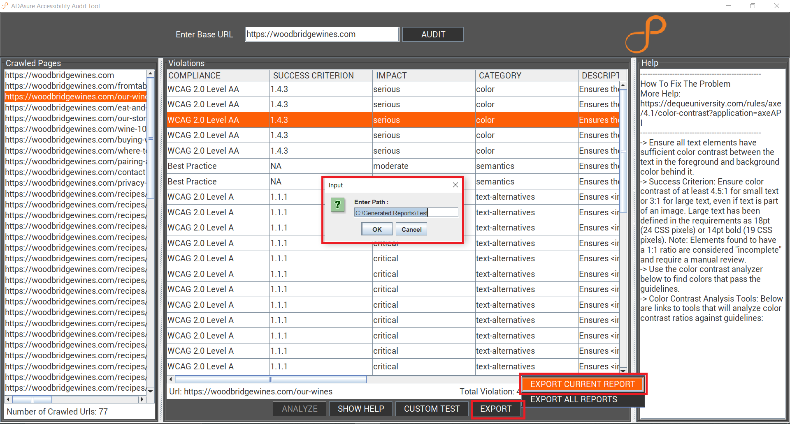
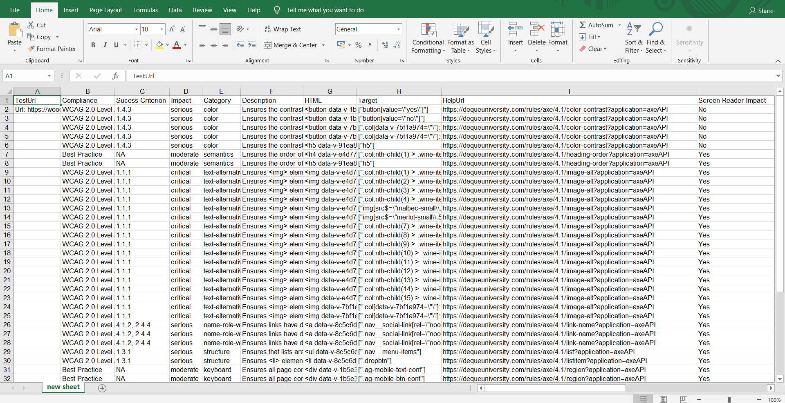

# ADAsure Accessibility Audit Tool 
##### INTRODUCTION:
ADAsure Accessibility Audit Tool  is a GUI tool developed in Java, using technologies like Selenium for Automation of testing and Axe-Core APIs for performing accessibility tests on webpages. It provides a simple and intuitive user interface to assist the user in testing and generating reports. These report helps the user to fix the violation of any desired website. The tool aids developers in identifying accessibility problems and features for WCAG 2.0, WCAG 2.1, Section 508 and AXE best standards. The frontend of this tool is developed using Java Swing in Eclipse IDE.

##### PRE-REQUISITE:
Eclipse IDE

Java Development Kit 8 or above 

Chrome driver (depends on the chrome browser version)

Stable internet connection

##### IMPORTING PROJECT:
Unzip the code file.
To import the code zip file in Eclipse IDE-:
File -> Import -> General -> Existing Projects into Workspace -> Next
Select Root directory (browse the unzipped file)- Search for nested projects
Finish

##### SETUP CONFIGURATIONS:
After importing the project in Eclipse IDE, setup the project as follows-
Wait till all the dependencies are loaded in the project, stable internet connection is required. 
Open config.properties file:
On left-side Package Explorer-> selenium-axe -> src/main/resources -> config.properties
In config.properties : 
A chromedriver should be downloaded for the specific chrome browser version. If you are using Chrome version 88, please download ChromeDriver 88.0.4324.
Official Website to download chrome driver- https://chromedriver.chromium.org/downloads 

1. pathToChromeDriver - copy paste the path location of the chromedriver that is installed on the machine 
e.g. pathToChromeDriver=C:\\chromedriver.exe

2. ExportAllPath - copy paste the path location of the folder where all the reports should be saved. 
e.g. ExportAllPath=C:\\Generated Reports\\Test
Here, Test is the folder name where all the reports will be saved. 

3. ExportOnePath - copy paste the path location of the folder where any report should be saved.
e.g. ExportOnePath=C:\\Generated Reports\\Test
Here, Test is the folder name where the specific report will be saved.
NOTE: Use Double Slashes ( \\ ) instead of Single Slash ( \ ) while setting paths and make sure the paths exist on the file system.
These paths will be considered as default path while saving the reports, this can be changed at runtime as well. 

##### EXECUTION:
To run the application:
On left-side Package Explorer-> selenium-axe -> src/main/java -> gui -> ApplicationRunner.java
Run “ApplicationRunner.java” file using the green play button provided by Eclipse IDE else right click and Run as -> Java Application.  

##### WORKING OF THE TOOL:
1. The user enters a Base URL i.e. the website URL that is to be audited. 
2. The website is crawled, first looking up for a sitemap.xml of the website else uses the crawler algorithm to list all the URLs present in the website.
3. Any URL can be selected for analyzing. The selected URL can violate some rules defined by Web Content Accessibility Guidelines. These violations are listed down in this tool.
4. The user is provided with some help to fix the violations.
5. The user is able to download the reports of violations in two formats- JSON and Excel files for the selected URL as well as all crawled URLs together.
6. The user can custom test a specific uncrawled URL and can generate similar reports.
7. The user is able to view the visualizations of the violations.

##### HOW TO USE THE TOOL:
###### Screenshots:
1. Main Page 
 
This is the main page of the tool. The user is able to view this page after running the application. 

2. Base URL
 
The website URL that is required to be audited should be entered in the text box. Make sure the URL is valid and in correct format. Click the "Audit" Button to analyse the website URL. 

3. Audit the website
 
After clicking the "Audit" button the user will be able to see all crawled URLs that is all the URLs that are present under the main URL. These URLs are displayed in the "Crawled Pages" section. The Number of Crawled URLs are displayed at the bottom.

4. Analyze URL
 
Select any URL which needs to be analyzed. Click on the "Analyze" button. A prompt box will pop up and ask the user's permission to start analyzing the selected URL. If the user wishes to continue then select "Yes" else click on "No". Alternatively, the user can also double click on the URL from the list to start the analysis.  

5. Violations
  
After clicking "Yes", all the violations of the selected URL will be loaded and listed down in the "Violations" section. Here, the user can view the Compliance, Success Criterion, Impact, Category, Description, HTML element, Target element and Help URL of the violation. One row in the violation table corresponds to one violation in the analyzed page. The current URL which is analyzed and the Total Violations found are displayed below. 

6. Sorting and Filtering Violations

Before Filtering
  
Right Click on the column heading to get the filtering option. The user can select any parameter to filter the data of the violation table.
After Filtering
  
 
After clicking "Apply" the user will be able to see only the violations of the selected parameter. 
Sorting- Click on the column heading once to sort the data in ascending order. Click on the column heading again to sort the data in descending order.  
This feature can be applied on all columns.

7. Help 
  
If the user wants to know more about any violation then select the desired violation. Click on "Show Help" button. In the "Help" section, additional information regarding the violation will be displayed with an help URL which will assist the user to fix that violation. Alternatively the user can also double click on the violation to get help.

8. Export Current Report 
 
A report can be generated of the violations that are displayed on the screen. To generate a report, click on "Export" button. The user will be asked for two options- Export Current Report and Export All Reports. Click on "Export Current Report". A popup will ask the user for a path to store these reports with a default path provided already which the user can change. After clicking "OK", the reports will be saved to the desired location. 

9. Saved Reports
  
The reports are saved to the desired location in two formats- json file and excel file. Json file is for the internal tool purpose and Excel file has the violation report used for reference.
 JSON FILE:
 
EXCEL FILE:
  

10. Export All Reports
  
The user can export all reports for all the crawled URLs by providing the desired path location to save the reports. The time taken by this process depends upon factors like Internet speed and number of crawled pages which might sometimes take longer time.

11. Custom Test
  
The user can analyze a specific uncrawled URL using the Custom Test option. Click on "Custom Test" button. Enter a valid URL in the text box provided. Click "OK" to start analyzing the URL. The violations for the URL will be listed in the "Violations" section. The user can use Show Help, Export Reports features for this URL. 

12. Visualization
  
The user is able to see the visualization of the violations. Click the "Visualize" button. A popup will appear where user can select any model like Pie Chart, Donut Chart, Bar Graph, Line Graph and Multi Model. After selection click "Show". The desired visualization will be displayed.

Pie Chart
  
Donut Chart
  
Bar Graph
  
Line Graph
  
Multi Model
 
 

